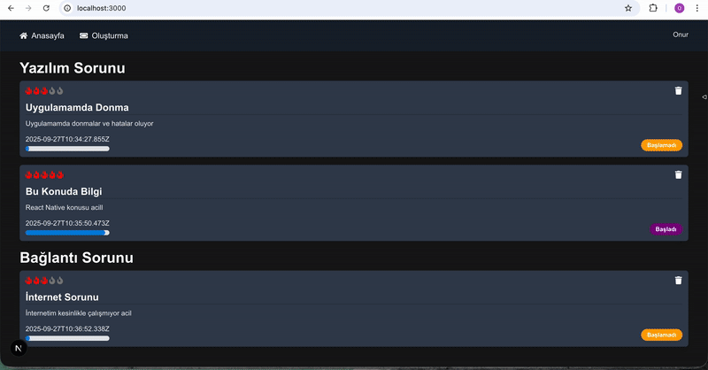

# Ticket App (Next.js)

Bir **ticket yönetim uygulaması**. Kullanıcılar ticket oluşturabilir, güncelleyebilir, silebilir ve **kategorilere göre** listeleyebilir.

## Özellikler

- ✅ Ticket **oluşturma** / **güncelleme** / **silme** (CRUD)
- ✅ **Kategorilere göre** gruplama ve listeleme
- ✅ MongoDB + Mongoose ile kalıcı veri
- ✅ App Router (Next.js 15) + Server/Client Components
- ✅ Tailwind CSS 4 ile sade arayüz
- ✅ TypeScript desteği
- ✅ `react-icons` ile ikonlar
- responsive

## Teknolojiler

- **Next.js** 15.5.4
- **React** 19
- **Tailwind CSS** 4
- **TypeScript** 5
- **MongoDB** & **Mongoose** 8
- **react-icons**

## Ekran Gif

# ticketApp-nextJs
